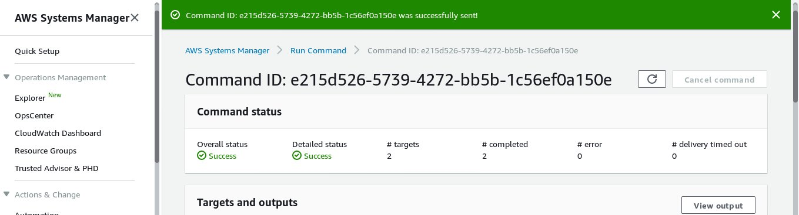

####  AWS Systems Manager lets you remotely and securely manage the configuration of your managed instances. It helps you automate management tasks.

- Create IAM Role - Assign Permissions
 > Role >> Ec2 >> Ec2 role for AWS system manager

- Create EC2 & Assign IAM Role 
- Run Command

#### User Data section in the Ec2 instance creation :

```
Installing the ssm agent in the ec2 instances :

#!/bin/bash
cd /tmp
sudo yum install -y https://s3.amazonaws.com/ec2-downloads-windows/SSMAgent/latest/linux_amd64/amazon-ssm-agent.rpm
yum install -y amazon-ssm-agent.rpm
sudo systemctl start amazon-ssm-agent
sudo systemctl enable amazon-ssm-agent
```
#### To run commands in multiple ec2 instances :

> Services > Aws System manager > Run command option at the left hand side > Run comand > selct the option "AWSrunshellscript" > Paste the command you wish to run in the command section > You can select the instances namually or filter via tags (key and value)

#### Sample command to get the ec2 instance information 
```
echo -e "{
 'Hostname':'`curl http://169.254.169.254/latest/meta-data/local-hostname --silent`', \
\n 'AMI-ID':'`curl http://169.254.169.254/latest/meta-data/ami-id --silent`', \
\n 'Kernel-Version':'`rpm -q kernel`' \
\n 'Instance Type':'`curl http://169.254.169.254/latest/meta-data/instance-type --silent`'
 }"
 ```


